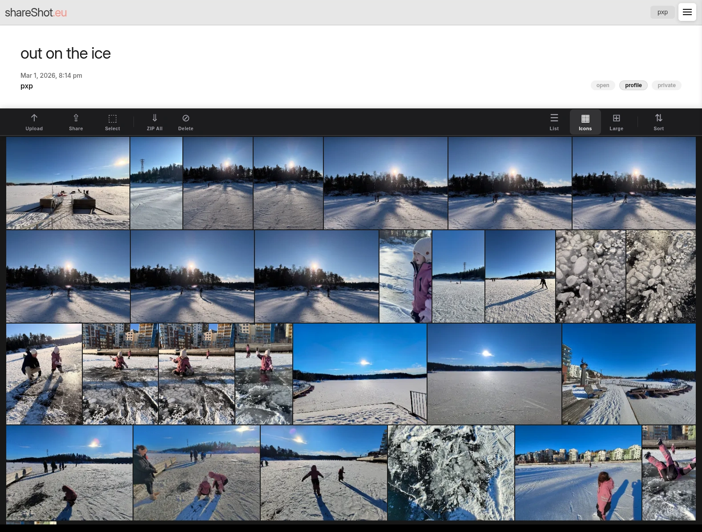

# 📸 PartyShots

[](https://fastapi.tiangolo.com/)
[](https://reactjs.org/)
[](https://www.docker.com/)
[](https://aws.amazon.com/)

**PartyShots** is a high-performance, real-time photo-sharing platform designed for seamless event photography and collaborative albums. Built with a modern tech stack, it features direct-to-S3 uploads, real-time WebSocket updates, and a glassmorphic React interface.

### [Live Site](http://51.20.201.88/) 
_(if the EC2 VM is running)_


---

## ✨ Project Preview


*Experience a clean, modern, and minimal design tailored for effortless photo sharing.*

---

## 🚀 Key Features

- **🔐 Secure Authentication**: JWT-based user accounts with persistent sessions and authorized WebSocket connections.
- **📁 Collaborative Albums**: Create albums with granular permissions:
  - **Open**: Allow anyone to contribute photos to your event.
  - **Public**: Showcase your best work on your public profile.
- **☁️ Direct S3 Uploads**: Files bypass the server and go straight to AWS S3 via presigned URLs, ensuring maximum performance and minimal server load.
- **⚡ Real-time Updates**: Instant UI refreshes across all devices using Redis Pub/Sub and WebSockets.
- **🖼️ Smart Metadata**: Automatic tracking of photo sizes and dimensions via background workers.
- **🔍 Global Search**: Quickly find albums and users with built-in search functionality.
- **🛠️ Admin Dashboard**: Monitor storage usage and manage system integrity.

---

## 🛠️ Tech Stack

### Backend
- **FastAPI**: Asynchronous Python framework for high-concurrency APIs.
- **Postgres**: Reliable relational database for metadata.
- **Redis**: Powering real-time messaging and WebSocket synchronization.
- **Arq**: Distributed background job processing.
- **S3 & Boto3**: Scalable object storage for high-resolution images.

### Frontend
- **React 18**: Modern UI development with Hooks and Context API.
- **Vite**: Lightning-fast build tool and development server.
- **Vanilla CSS**: Premium, custom-crafted styles with a focus on aesthetics.

The included docker-compose.yml file is configured to run the full required stack, including the database, redis, arq worker, nginx reverse proxy, and FastAPI with gunicorn and uvicorn workers.  


---

## Performance Optimizations

- **Client‑side thumbnail generation** – Thumbnails are created in the browser before upload, eliminating server‑side image processing.  
- **Direct S3 uploads** – Images are sent straight to S3 via presigned URLs, bypassing the application server.  
- **Background size sync** – A worker polls S3 for photo and thumbnail sizes and updates the database with this metadata.  

### Browsing Experience

- The front‑end fetches presigned URLs for thumbnails and full‑size images, while the backend caches them in **Redis** to avoid repeated S3 look‑ups.  
- Album items that are off‑screen are not rendered (lazy loading).  
- Thumbnails are paginated; the client requests presigned URLs only for thumbnails currently in view.  

### Downloads & Deletions

- Files are downloaded directly from S3 via presigned URLs.  
- Background workers also handle deletion of items from S3, keeping storage in sync with the database.

### Deployment
- **Docker**: Containerization for easy deployment.
- **AWS**: S3 for storage and EC2 for hosting.
- **NGINX**: Reverse proxy for static file serving.
- **docker compose**: Orchestration of the stack.


---


## ⚙️ Getting Started

### Prerequisites
- Docker & Docker Compose
- AWS Account (S3 Bucket)
- Node.js (for local frontend development)
- Python 3.10+ (for local backend development)

### Quick Start with Docker
1. **Clone the repository**:
   ```bash
   git clone https://github.com/pxp888/partyshot-fastapi.git
   cd partyshot-fastapi
   ```

2. **Configure Environment**:
   Create the following files (refer to `example.env` templates):
   - `.env`: Database credentials for Docker Compose.
   - `backend/env.py`: AWS keys, Redis URL, and JWT secrets.
   - `frontend/.env`: WebSocket and API endpoint URLs.


3. **Build the frontend**:
   ```bash
   cd frontend
   npm install
   npm run build
   ```


4. **Launch the stack**:
   ```bash
   docker build -t fast1 .
   docker-compose up -d
   ```

5. **Verify the stack**:
   ```bash
   docker ps
   ```

---

## 📦 Deployment Notes

- **Build Frontend First**: The frontend must be built (`npm run build`) before creating the production Docker image, as the backend serves the static assets.
- **NGINX**: A pre-configured `nginx.conf` is provided to handle reverse proxying and static file serving.
- **EC2 Hosting**: Optimized for deployment on Amazon EC2 with S3 integration.

---

## 🗺️ Roadmap
- [ ] CloudFront integration for faster global delivery.
- [ ] Advanced album editor permissions.
- [ ] Mobile-first progressive web app (PWA) features.
- [ ] Managed database


---

## 📄 License
Individual/Private Use. See repository owner for details.

---
*Created with ❤️ by [pxp888](https://github.com/pxp888)*
