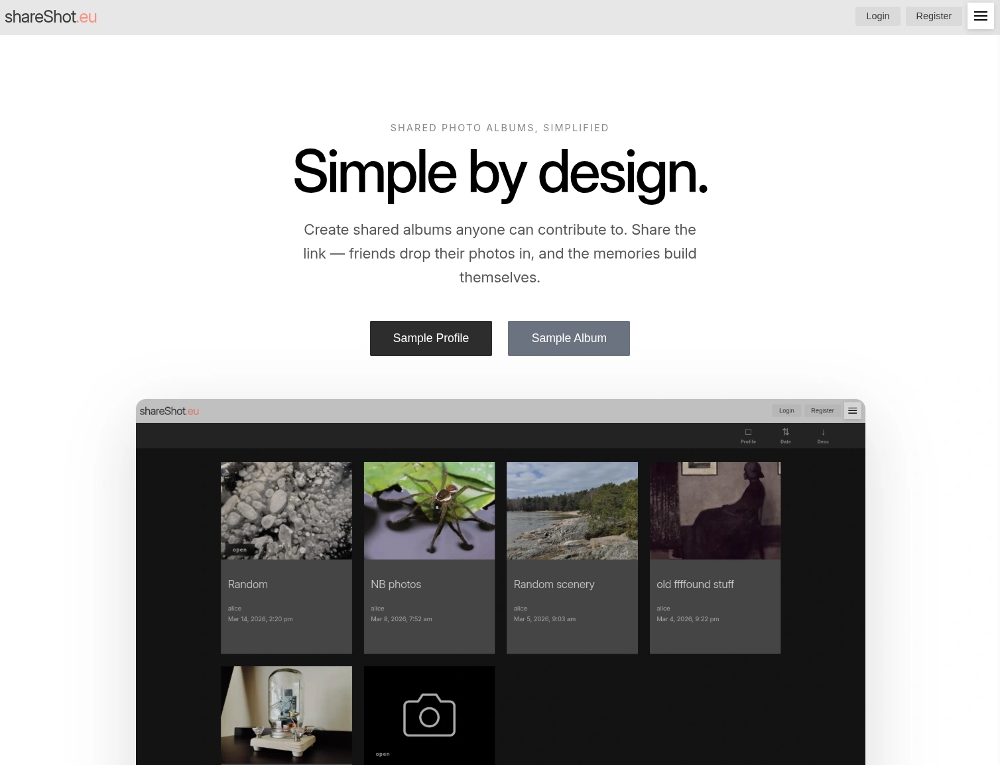
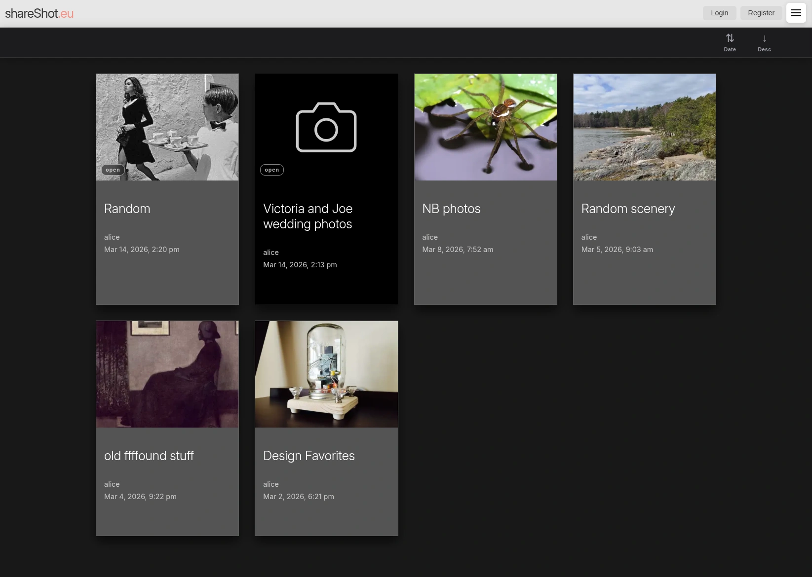
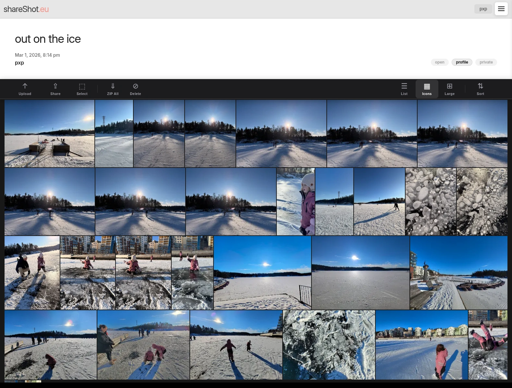

**📸 shareShots**  








**shareShots** is a high-performance, real-time photo-sharing platform designed for seamless event photography and collaborative albums. Built with a modern tech stack, it features direct-to-R2 uploads, real-time WebSocket updates, and a modern React interface.  
[www.shareshot.eu](https://www.shareshot.eu/ "https://www.shareshot.eu/")  
  
**✨ Project Preview**  
  
   
  
*Experience a clean, modern, and minimal design tailored for effortless photo sharing.*  
  
**🚀 Key Features**  
- **🔐 Secure Authentication**: JWT-based user accounts with persistent sessions and authorized WebSocket connections.  
- **💳 Integrated Payments**: Subscription-based model powered by **Stripe**, featuring tiered storage plans and a self-service billing portal.  
- **📁 Collaborative Albums**: Create albums with granular privacy settings:  
  - **Open**: Allow anyone to contribute photos to your event.  
  - **Private**: Restrict access to authorized users.  
  - **Profile**: Showcase your best work publicly on your profile.  
- **☁️ Direct-to-R2 Uploads**: Files bypass the server and go straight to Cloudflare R2 via presigned URLs, ensuring maximum performance. Supports original, mid-sized, and thumbnail assets.  
- **⚡ Real-time Updates**: Instant UI refreshes across all devices using Redis Pub/Sub and WebSockets (via `react-use-websocket`).  
- **🖼️ Smart Metadata**: Automatic tracking of photo sizes and dimensions via background workers.  
- **📦 Bulk Operations**: Download entire albums as a ZIP file (using JSZip) or manage multiple files simultaneously.  
- **📱 Mobile Optimized**: Responsive design with touch-friendly navigation and QR code sharing for instant album access.  
- **📧 Notifications**: Automated email delivery for contact form submissions and secure password recovery.  
  
**🛠️ Tech Stack**  
**Backend & Infrastructure**  
- **FastAPI**: Asynchronous Python framework for high-concurrency APIs.  
- **PostgreSQL**: Reliable metadata storage with a focus on atomic transactions and storage tracking.  
- **AWS Fargate**: Serverless container execution for the API and background workers.  
- **Amazon ElastiCache (Redis)**: Powering real-time messaging, WebSocket synchronization, and job queuing.  
- **Arq**: Distributed background job processing for image validation and email delivery.  
- **Cloudflare R2**: Scalable S3-compatible object storage for high-resolution images.  
- **Cloudflare Tunnel**: Secure outbound-only connection bypassing the need for AWS ALBs or open ports.  
- **Stripe API**: Secure payment processing and subscription lifecycle management.  
**Frontend**  
- **React 19**: Latest React features for a highly interactive and performant UI.  
- **Vite 7**: Lightning-fast build tool and development server.  
- **Vanilla CSS**: Premium, custom-crafted styles for a unique and modern aesthetic.  
  
**Performance Optimizations**  
- **Client-side asset generation**: Thumbnails and mid-sized previews are created in the browser before upload, eliminating server-side image processing costs.  
- **Presigned URL Caching**: The backend caches retrieval URLs in Redis to minimize R2 metadata lookups.  
- **Lazy Loading & Virtualization**: Only off-screen album items are not rendered, and thumbnails are paginated based on viewport visibility.  
- **Stateless Architecture**: Horizontal scaling enabled via ASG and stateless containers.  
  
**💰 Subscription Plans**  
| Plan | Storage | Features |
| :--- | :--- | :--- |
| **Free** | 100 MB | Core sharing features, collaborative albums. |
| **Starter** | 1 GB | Increased storage for personal events. |
| **Basic** | 5 GB | Standard storage for active photographers. |
| **Pro** | 100 GB | Professional grade storage for large events and studios. |  
  
**⚙️ Getting Started**  
**Prerequisites**  
- Podman or Docker  
- AWS Account (ECR, ECS, RDS, ElastiCache)  
- Cloudflare Account (R2, Tunnels)  
- Stripe Account (for payments)  
- Gmail App Password (for email notifications)  
**Local Development**  
1. **Configure Environment**: Create a `.env` file in `backend/` based on `blankenv.py`.  
2. **Frontend Setup**:  
   ```bash
   cd frontend && npm install && npm run dev
   ```
3. **Backend Setup**:  
   ```bash
   pip install -r requirements.txt
   python backend/main.py
   ```
**Cloud Deployment Workflow**  
1. **Build and Push**:  
   ```bash
   ./buildup.sh  # Build frontend, copy to static, and push container to ECR
   ```
2. **Redeploy**: Update the ECS Service with **"Force new deployment"** to pull the latest image.  
  
**📦 Infrastructure Notes**  
- **Fargate Services**: Split into `shareshot-api` (API + Tunnel sidecar) and `shareshot-worker` (arq background tasks).  
- **Security**: Zero open inbound ports on AWS; all traffic is routed through encrypted Cloudflare Tunnels.  
- **Redis Connectivity**: Uses non-cluster mode to ensure compatibility with `arq` atomic operations.  
  
**🗺️ Roadmap**  
- Mobile-first Progressive Web App (PWA) installation.  
- Native Cloudflare Pages hosting for frontend assets to reduce Fargate load.  
- Advanced analytics dashboard for album engagement.  
  
**📄 License**  
Individual/Private Use. See repository owner for details.  
  
*Created with ❤️ by *[ *pxp888*](https://github.com/pxp888 "https://github.com/pxp888")  
